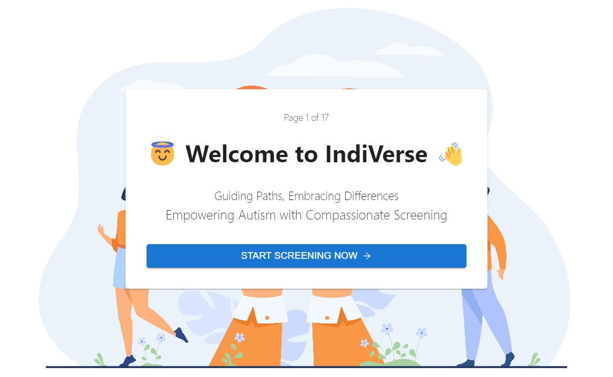

# IndiVerse 😇

Simple autism screening application using ANN model. Built using TensorFlow & React.

A mini project for Computational Intelligence university subject. 

[**👉 Application Here 👈**](https://indi-verse.vercel.app/)

---

## Sources & References 🏭

- [Google Colab](https://colab.research.google.com/drive/14jQ3a0CI3pll_uIspdtDYxhyQSYkys5b?usp=sharing)

- [Kaggle Dataset](https://www.kaggle.com/datasets/andrewmvd/autism-screening-on-adults)

- [Notebook by Muhammad Shahrayar](https://www.kaggle.com/code/muhammadshahrayar/autistic-patients-eda-classification-using-ann/notebook)

- [Background Vector by Freepik](https://www.freepik.com/free-vector/charity-donation-concept-hands-volunteers-holding-giving-heart_11235259.htm)